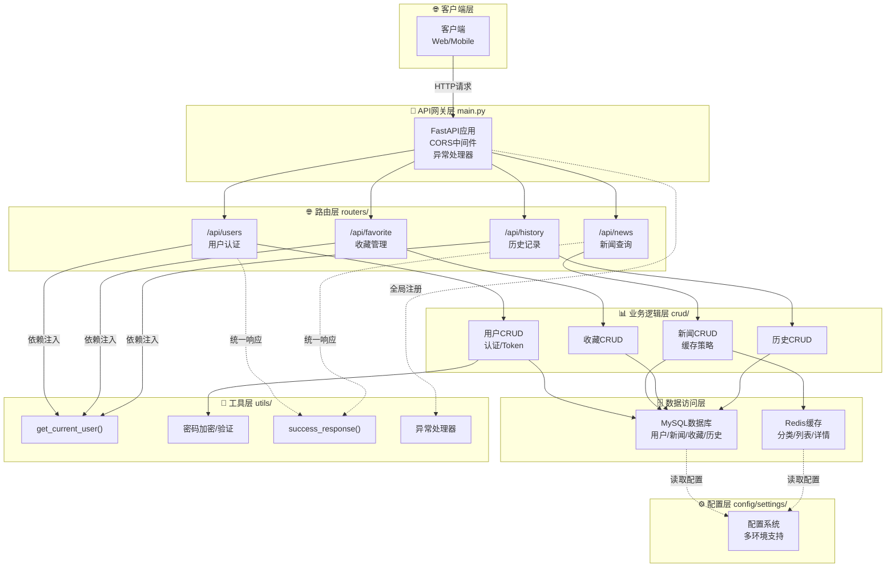
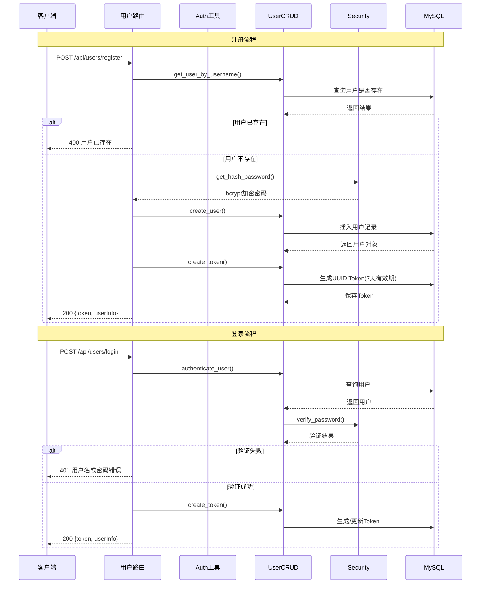
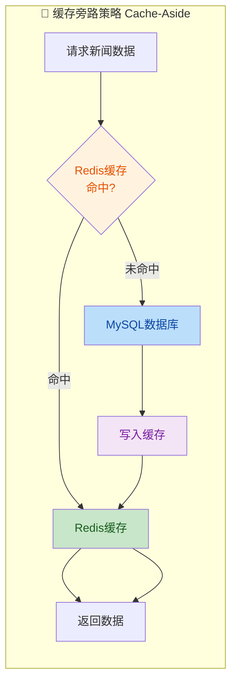

# 📰 头条后端服务

基于 FastAPI 构建的现代化头条新闻后端服务，提供用户管理、新闻浏览、收藏和历史记录等核心功能。🚀

**项目亮点：**
- ✨ 采用 FastAPI + MySQL + Redis 异步架构
- 🔐 实现安全的用户认证机制（UUID Token + bcrypt 加密）
- 📊 集成 Redis 缓存优化查询性能
- 🎯 支持新闻分类、推荐和浏览量统计
- ❤️ 完整的收藏和浏览历史功能
- 🛡️ 全局异常处理和统一响应格式
- ⚙️ 支持多环境配置（开发/测试）

---

## 🛠️ 1. 技术栈

| 分类 | 技术 | 版本 |
|------|------|------|
| 🧩 框架 | FastAPI | ≥0.136.1 |
| 🗄️ 数据库 | MySQL + SQLAlchemy | ≥2.0.0 (异步) |
| ⚡ 缓存 | Redis | ≥7.4.0 |
| 🔑 密码加密 | passlib (bcrypt) | ≥1.7.4 |
| 📦 包管理 | uv | - |
| 🐍 运行时 | Python | ≥3.14 |

## 📋 2. 环境要求

- **Python**: 3.14+ 🐍
- **MySQL**: 5.7+ 或 MariaDB 10.3+ 🗄️
- **Redis**: 6.0+ ⚡

## 🚀 3. 快速开始

### 3.1 安装依赖

```bash
# 使用 uv 安装依赖（快如闪电 ⚡）
uv sync
```

### 3.2 配置管理

项目采用多环境配置系统，支持开发环境和测试环境的自动切换：

**配置文件结构：**
```
config/
└── settings/
    ├── __init__.py        # 配置加载器
    ├── base.py            # 基础配置（所有环境共享）
    ├── development.py     # 开发环境配置
    └── test.py            # 测试环境配置
```

**环境变量切换：**
```bash
# 开发环境（默认）- 使用 MySQL + Redis DB 0
uv run uvicorn main:app --reload

# 测试环境 - 使用 SQLite 内存数据库 + Redis DB 15
APP_ENV=test uv run pytest tests/
```

**配置项说明：**

| 配置项 | 开发环境 | 测试环境 |
|--------|----------|----------|
| 数据库 | MySQL (`news_app`) | SQLite 内存数据库 |
| Redis DB | 0 | 15 |
| SQLAlchemy Echo | True | False |

### 3.3 初始化数据库

```bash
# 执行 SQL 脚本创建表结构
mysql -u username -p database_name < database.sql
```

### 3.4 启动服务

```bash
# 开发模式（自动重载 🔄）
uv run uvicorn main:app --reload --host 0.0.0.0 --port 8000

# 生产模式
uv run uvicorn main:app --host 0.0.0.0 --port 8000
```

## 📖 4. API 文档

启动服务后访问：

- **Swagger UI**: http://localhost:8000/docs 🎨
- **ReDoc**: http://localhost:8000/redoc 📚

## 📁 5. 项目结构

```
toutiao_backend/
├── cache/              # 🚀 缓存逻辑
│   └── news_cache.py
├── config/             # ⚙️ 配置文件
│   ├── cache_conf.py   # Redis 配置
│   ├── db_conf.py      # 数据库配置
│   └── settings/       # 📝 多环境配置
│       ├── __init__.py
│       ├── base.py
│       ├── development.py
│       └── test.py
├── crud/               # 📊 CRUD 操作
│   ├── favorite.py     # 收藏操作
│   ├── history.py      # 历史记录操作
│   ├── news_cache.py   # 新闻操作（含缓存）
│   └── users.py        # 用户操作
├── models/             # 🗄️ 数据库模型
│   ├── favorite.py
│   ├── history.py
│   ├── news.py
│   └── users.py
├── routers/            # 🌐 API 路由
│   ├── favorite.py
│   ├── history.py
│   ├── news.py
│   └── users.py
├── schemas/            # 📝 数据模型
│   ├── base.py
│   ├── favorite.py
│   ├── history.py
│   └── users.py
├── utils/              # 🧰 工具函数
│   ├── auth.py         # 认证工具
│   ├── exception.py    # 异常定义
│   ├── exception_handlers.py  # 异常处理器
│   ├── response.py     # 响应封装
│   └── security.py     # 安全工具
├── main.py             # 🚪 应用入口
├── pyproject.toml      # 📦 项目配置
├── uv.lock             # 🔒 依赖锁文件
└── database.sql        # 📋 数据库初始化脚本
```

## 🌐 6. API 功能

### 6.1 👤 用户模块

| 端点 | 方法 | 功能 | 认证 |
|------|------|------|------|
| `/api/users/register` | POST | 用户注册 | ❌ |
| `/api/users/login` | POST | 用户登录 | ❌ |
| `/api/users/info` | GET | 获取用户信息 | ✅ |
| `/api/users/update` | PUT | 更新用户信息 | ✅ |
| `/api/users/password` | PUT | 修改密码 | ✅ |

### 6.2 📰 新闻模块

| 端点 | 方法 | 功能 | 参数 |
|------|------|------|------|
| `/api/news/categories` | GET | 获取分类列表 | skip, limit |
| `/api/news/list` | GET | 获取新闻列表 | categoryId, page, pageSize |
| `/api/news/detail` | GET | 获取新闻详情 | id |

### 6.3 ❤️ 收藏模块

| 端点 | 方法 | 功能 | 认证 |
|------|------|------|------|
| `/api/favorite/check` | GET | 检查收藏状态 | ✅ |
| `/api/favorite/add` | POST | 添加收藏 | ✅ |
| `/api/favorite/remove` | DELETE | 删除收藏 | ✅ |
| `/api/favorite/list` | GET | 获取收藏列表 | ✅ |
| `/api/favorite/clear` | DELETE | 清空收藏 | ✅ |

### 6.4 📜 浏览历史模块

| 端点 | 方法 | 功能 | 认证 |
|------|------|------|------|
| `/api/history/add` | POST | 添加历史记录 | ✅ |
| `/api/history/list` | GET | 获取历史列表 | ✅ |
| `/api/history/delete/{history_id}` | DELETE | 删除单条历史 | ✅ |
| `/api/history/clear` | DELETE | 清空历史 | ✅ |

## 📊 7. 可视化架构图

### 7.1 🏗️ 系统架构流程图



### 7.2 🔐 用户认证流程图



### 7.3 ⚡ 新闻查询缓存策略



## ✨ 8. 核心特性

### 8.1 📦 依赖清单

| 包名 | 版本 | 用途 |
|------|------|------|
| fastapi[standard] | ≥0.136.1 | Web框架 + 自动文档 🎨 |
| sqlalchemy[asyncio] | ≥2.0.0 | 异步ORM 🗄️ |
| aiomysql | ≥0.3.2 | MySQL异步驱动 ⚡ |
| redis | ≥7.4.0 | Redis缓存客户端 💾 |
| passlib | ≥1.7.4 | 密码加密（bcrypt）🔐 |
| uvicorn | ≥0.46.0 | ASGI服务器 🚀 |

### 8.2 🗄️ 数据库设计

| 表名 | 用途 | 关键字段 |
|------|------|----------|
| `user` | 用户信息 | id, username, password, avatar |
| `user_token` | 用户令牌 | user_id, token, expires_at |
| `news_category` | 新闻分类 | id, name, sort_order |
| `news` | 新闻内容 | id, title, content, category_id, views |
| `favorite` | 收藏记录 | user_id, news_id |
| `history` | 浏览历史 | user_id, news_id, view_time |

### 8.3 💾 缓存配置

| 数据类型 | 键格式 | 过期时间 |
|----------|--------|----------|
| 新闻分类 | `news:categories` | 7200秒（2小时）⏰ |
| 新闻列表 | `newsList:{category_id}:{page}:{size}` | 7200秒 |
| 新闻详情 | `news:details:{news_id}` | 7200秒 |
| 相关新闻 | `news:related:{category_id}:{news_id}:{limit}` | 3600秒 |

### 8.4 🔐 认证机制

- **密码加密**: 使用 bcrypt 算法（安全可靠 🔒）
- **Token生成**: UUID v4，有效期7天
- **Token验证**: 从 HTTP Header `Authorization: Bearer {token}` 提取
- **依赖注入**: `get_current_user()` 自动验证 Token

### 8.5 🛡️ 异常处理

| 异常类型 | HTTP状态码 | 说明 |
|----------|------------|------|
| `HTTPException` | 400-499 | 业务逻辑异常 ⚠️ |
| `IntegrityError` | 400 | 数据库约束冲突 |
| `SQLAlchemyError` | 500 | 数据库操作异常 |
| `Exception` | 500 | 兜底异常处理 |

**统一响应格式：**
```json
{
  "code": 200,
  "message": "success",
  "data": {}
}
```

### 8.6 ⚙️ 多环境配置

项目支持通过环境变量 `APP_ENV` 切换不同配置：

| 环境 | APP_ENV 值 | 数据库 | Redis DB |
|------|-----------|--------|----------|
| 开发环境 | `development`（默认） | MySQL | 0 |
| 测试环境 | `test` | SQLite 内存 | 15 |

**配置文件说明：**

- `config/settings/base.py` - 基础配置，所有环境共享
- `config/settings/development.py` - 开发环境配置，继承并覆盖基础配置（启用 DEBUG、输出 SQL 日志）
- `config/settings/test.py` - 测试环境配置，继承并覆盖基础配置（使用 SQLite 内存数据库）
- `config/settings/__init__.py` - 配置加载器，根据环境变量选择配置类

## 🧪 9. 开发

```bash
# 安装所有依赖（主依赖 + 开发依赖）
uv sync --all-groups

# 运行测试 🧪（自动使用测试环境配置）
uv run pytest

# 格式化代码 ✨
uv run black .

# 类型检查 🔍
uv run mypy .
```

## 📜 10. 许可证

MIT License 📄
